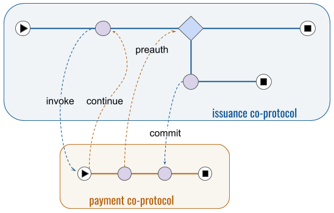
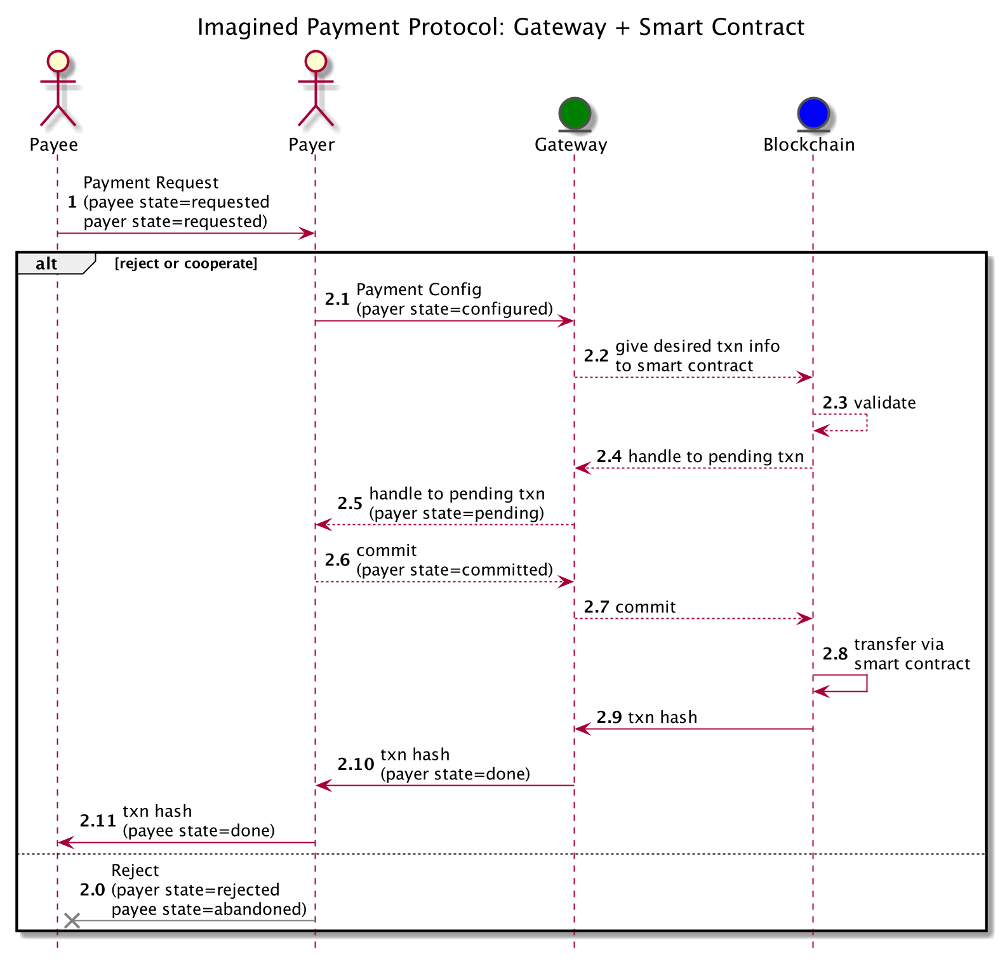
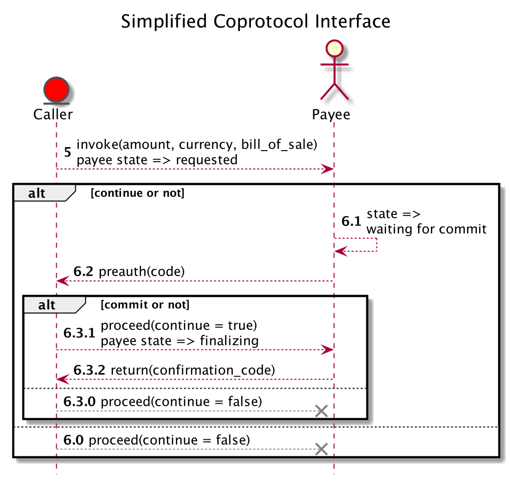

# Aries RFC 0478: Coprotocols
- Authors: [Daniel Hardman](daniel.hardman@gmail.com)
- Status: [STALLED](/README.md#stalled)
- Since: 2024-04-03
- Status Note: No recent progress and no implementations have been created.
- Start Date: 2020-02-03
- Tags: [concept](/tags.md#concept), [protocol](/tags.md#protocol)

[](https://j.mp/2XgyjH3)

## Summary

Explains how one protocol can invoke and interact with others, giving inputs and receiving outputs and errors.

## Motivation

It's common for complex business workflows to be composed from smaller, configurable units of logic. It's also common for multiple processes to unfold in interrelated ways, such that a complex goal is choreagraphed from semi-independent tasks. Enabling flexible constructions like this is one of the major goals of protocols built atop DIDComm. We need a standard methodology for doing so.

## Tutorial

A [protocol is any recipe for a stateful interaction](../0003-protocols/README.md). [DIDComm](../0005-didcomm/README.md) itself is a protocol, as are many primitives atop which it is built, such as HTTP, Diffie-Hellman key exchange, and so forth. However, when we talk about protocols in decentralized identity, without any qualifiers, we usually mean application-level interactions like [credential issuance](../../features/0036-issue-credential/README.md), [feature discovery](../../features/0031-discover-features/README.md), [third-party introductions](../../features/0028-introduce/README.md), and so forth. These protocols are message-based interactions that use DIDComm.

We want these protocols to be __composable__. In the middle of issuing credentials, we may want to challenge the potential holder for proof -- and in the middle of challenging for proof, maybe we want to negotiate payment. We could build proving into issuing, and payment into proving, but this runs counter to the [DRY principle](https://en.wikipedia.org/wiki/Don%27t_repeat_yourself) and to general best practice in encapsulation. A good developer writing a script to issue credentials would probably isolate payment and proving logic in separate functions or libraries, and would strive for [loose coupling](https://en.wikipedia.org/wiki/Loose_coupling) so each could evolve independently.

Agents that run protocols have goals like those of the script developer. How we achieve them is the subject of this RFC.

### Subroutines

In the world of computer science, a subroutine is a vital abstraction for complex flows. It breaks logic into small, reusable chunks that are easy for a human to understand and document, and it formalizes their interfaces. Code calls a subroutine by referencing it via name or address, providing specified arguments as input. The subroutine computes on this input, eventually producing an output; the details don't interest the caller. While the subroutine is busy, the caller typically waits. Callers can often avoid recompilation when details inside subroutines change. Subroutines can come from pluggable libraries. These can be written by different programmers in different programming languages, as long as a calling convention is shared.

Thinking of protocols as analogs to subroutines suggests some interesting questions:  

* How do we invoke one protocol from another?
* How does a protocol emit an output?
* What is the calling convention?
* How do errors propagate (or exceptions get thrown and handled)?
* How can we make protocols work like higher-order functions (functions that take other functions as parameters)?

### Coroutines

Before we answer these questions, let's think about a generalization of subroutines that's slightly less familiar to some programmers: __coroutines__. Coroutines achieve the same encapsulation and reusability as subroutines, but as a category they are more flexible and powerful. Coroutines may be, but aren't required to be, call-stack "children" of their callers; they may have complex lifecycles that begin or end outside the caller's lifespan. Coroutines may receive inputs at multiple points, not just at launch. They may yield outputs at multiple points, too. Subroutines are just the simplest variant of coroutines.

The flexiblity of coroutines gives options to programmers, and it explains why most programming languages evolve to offer them as first-class constructs when they encounter demanding requirements for asynchronicity, performance, or scale. For example, early versions of python lacked the concept of coroutines; if you wrote a loop over `range(1, 1000000)`, python allocated and filled a container holding 1 million numbers, and then iterated over the container. When generators (a type of coroutine) were added to the language, the underlying logic changed. Now `range(1, 1000000)` is a coroutine invocation that trades execution state back and forth with its sibling caller routine. The first time it is invoked, it receives and stores its input values, then produces one output (the lower bound of the range). Each subsequent time through the loop it is invoked again; it increments its internal state and yields a new output back to the caller. No allocations occur, and an early break from the loop wastes nothing.

If we want to choose one conceptual parallel for how protocols relate to one another, we should think of them as coroutines, not subroutines; doing so constrains us less. Although payment as a subroutine inside credential issuance sounds plausible at first glance, it turns out to be clumsy under deeper analysis. A payment protocol yields more than one output -- typically a preauthorization at an intermediate stage, then a final outcome when it completes. At the preauthorization stage, it should accept graceful cancellation (a second input, after launch). And high-speed, bulk issuance of credentials is likely to benefit from payment and issuance being partly parallelized instead of purely sequential.



Similarly, a handshake protocol like [DID Exchange](../../features/0023-did-exchange/README.md) or [Connection](../../features/0160-connection-protocol/README.md) is best framed as a coprotocol of [Introduce](../../features/0028-introduce/README.md); this makes it easy for Introduce to complete as soon as the handshake begins, instead of waiting for the handshake to finish as if it were a subroutine.
 
By thinking of cross-protocol interactions like coroutine interactions, we get the best of both worlds: where the interaction is just subroutine-like, the model lets us simplify; where we need more flexibility and power, the model still fits.
 
Protocols don't have to support the types of coprotocol interactions we're describing here; protocols developed by Aries developers have already proven their value even without it. But to unlock their full potential, adding __coprotocol support__ to new and existing protocol definitions may be worthwhile. This requires only a modest update to a protocol RFC, and creates little extra work for implementers.

### The simple approach that falls apart

When the DIDComm community first began thinking about one protocol invoking another, we imagined that the interface to the called coprotocol would simply be its first message. For example, if verfiable credential issuer Acme Corp wanted to demand payment for a credential during an issuance protocol with Bob, Acme would send to Bob a `request_payment` message that constituted the first message in a `make_payment` protocol. This would create an instance of the payment protocol running alongside issuance; issuance could then wait until it completed before proceeding. And Bob wouldn't need to lift a finger to make it work, if he already supported the payment protocol.

Unfortunately, this approach looks less attractive after study: 

* It creates a tight coupling between issuance and payment. The logic inside issuance must know exactly what data format, semantics, and versioning rules apply to the payment protocol, in order to generate its first message. If the payment protocol changes, the issuance protocol breaks. There is no flexibility in issuance to negotiate an optimal payment protocol from among several alternatives that both parties support. The implementation of issuance is too opinionated about how to approach a logically independent task.

* It doesn't give Bob any context. We don't want to inconvenience Bob to support payment in conjunction with issuance, but we DO want Bob to know that the payment protocol instance he participates in is related to the credential issuance protocol that's also underway. This is more than just connecting the two with DIDComm's [message threading](../0008-message-id-and-threading/README.md); if one protocol is abandoned or completes or fails, something probably needs to happen in the other.

* It doesn't let Bob be the first mover. What if Bob should be requesting payment instead of Acme? (The [Protocol Role Request Protocol](https://github.com/hyperledger/aries-rfcs/blob/29c982e80bf29763a29ac9d036b332acd4b6f525/features/0474-protocol-role-request/index.md) partly addresses this need, but [lacks a formal way to give Bob data as input](https://github.com/hyperledger/aries-rfcs/pull/474/files#r424683769).)  

* It doesn't explain how the payment protocol emits output that its caller can consume. Individual agents could code proprietary answers to this question, but interoperability would be lost.

* It doesn't offer a signalling mechanism that would let the two protocols proceed in parallel, syncing up only when necessary.

* It doesn't explain how errors propagate, or how to decide what they mean for the calling protocol.

### General Interface Needs

What we want, instead, is a formal declaration of something a bit like a coprotocol's "function signature." It needs to describe the inputs that launch the protocol, and the outputs and/or errors emitted as it finishes. It should hide implementation details and remain stable across irrelevant internal changes. 

We need to bind compatible coprotocols to one another using the metadata in these declarations. And since coprotocol discovery may have to satisfy a remote party, not just a local one, our binding needs to work well dynamically, and late, and with optional, possibly overlapping plugins providing implementations. This suggests that our declarations must be rich and flexible about binding criteria &mdash; it must be possible to match on something more than just a coprotocol name and/or arg count+type.

An interesting divergence from the function signature parallel is that we may have to describe inputs and outputs (and errors) at multiple __interaction points__, not just the coprotocol's initial invocation. 

Another subtlety is that protocol interfaces need to be partitioned by role; the experience of a payer and a payee with respect to a payment protocol may be quite different. The interface offered by a coprotocol must vary by which role the invoked coprotocol instance embodies.

Given all these considerations, we choose to describe coprotocol interfaces using a _set_ of function-like signatures, not just _one_. We use a function-like notation to make them as terse and intuitive as possible for developers.

#### Example

Suppose we are writing a credential issuance protocol, and we want to use coprotocols to add support for situations where the issuer expects payment partway through the overall flow. We'd like it to be possible for our payment step to use Venmo/Zelle, or cryptocurrency, or traditional credit cards, or anything else that issuers and holders agree upon. So we want to encapsulate the payment problem as a pluggable, discoverable, negotiable coprotocol.

We do a little research and discover that many DIDComm-based payment protocols exist. Three of them advertise support for the same coprotocol interface:

```text
goal: aries.buy.make-payment
payee:
  get:
      - invoke(amount: float, currency: str, bill_of_sale: str) @ null
      - proceed(continue: bool) @ requested:, waiting-for-commit
  give:
      - preauth(code: str) @ waiting-for-commit
      - return(confirmation_code: str) @ finalizing
```

In plain English, the declared coprotocol semantics are:

>This is a coprotocol interface for protocols that facilitate the `aries.buy.make-payment` [goal code](https://github.com/hyperledger/aries-rfcs/blob/2aba468a9a4daae69e42ba764124ab602dd66982/concepts/0519-goal-codes/README.md). The `payee` role in this coprotocol gets input at two interaction points, "invoke" and "proceed". Invoke happens when state is null (at launch); "proceed" happens when state is "requested" or "waiting-for-commit." At invoke, the caller of the co-protocol provides 3 inputs: an amount, a currency, and a bill of sale. At proceed, the caller decides whether to continue. Implementations of this coprotocol interface also give output at two interaction points, "preauth" and "return." At preauth, the output is a string that's a preauth code; at return, the output is a confirmation code.

##### Simplified description only

It's important to understand that this interface is NOT the same as the protocol's direct interface (the message family and state machine that a protocol impl must provide to implement the protocol as documented). It is, instead, a simplified encapuslation -- just like a function signature is a simplified encapsulation of a coroutine. A function impl can rename its args for internal use. It can have steps that the caller doesn't know about. The same is true for protocols: their role names, state names, message types and versions, and field names in messages don't need to be exposed directly in a coprotocol interface; they just need a mapping that the protocol understands internally. The specific payment protocol implementation might look like this (don't worry about details; the point is just that some might exist):



When we describe this as a coprotocol, we omit most of its details, and we change some verbiage. The existence of the `payee`, `gateway` and `blockchain` roles is suppressed (though we now have an implicit new role -- the __caller__ of the coprotocol that gives what the protocol gets, and gets what the protocol gives). Smart contracts disappear. The concept of `handle to pending txn` is mapped to the coprotocol's `preauth` construct, and `txn hash` is mapped to the coprotocol's `confirmation_code`. As a coprotocol, the payee can interact according to a far simpler understanding, where the caller asks the payee to engage in a payment protocol, expose some simple hooks, and notify on completion:



##### Calling Convention

More details are needed to understand exactly how the caller and the coprotocol communicate. There are two sources of such details:

1. Proprietary methods
2. Standard Aries-style DIDComm protocol

Proprietary methods allow aggressive optimization. They may be appropriate when it's known that the caller and the coprotocol will share the same process space on a single device, and the code for both will come from a single codebase. In such cases, there is no need to use DIDComm to communicate.

Answer 2 may be more chatty, but is better when the coprotocol might be invoked remotely (e.g., Acme's server A is in the middle of issuance and wants to invoke payment to run on server B), or where the codebases for each party to the interaction need some independence.

The expectation is that co-protocols share a compatible trust domain; that is, coprotocol interactions occur *within* the scope of one identity rather than across identity boundaries. Thus, interoperability is not a strong requirement. Nonetheless, approaching this question as a standard protocol problem leads to a clean, loosely couple architecture with little incremental cost in an agent. Therefore, a protocol for coprotocol coordination has been developed. This is the subject of sister document [Aries RFC 0482: Coprotocol Protocol](../../features/0482-coprotocol-protocol/README.md).

## Reference

More about optional fields and syntax in a coprotocol declaration.

How to add a coprotocol decl to a protocol.

## Drawbacks

Why should we *not* do this?

## Rationale and alternatives

- Why is this design the best in the space of possible designs?
- What other designs have been considered and what is the rationale for not
choosing them?
- What is the impact of not doing this?

## Prior art

Coroutines &mdash; the computer science scaffolding against which coprotocols are modeled &mdash; are extensively discussed in the literature of various compiler developer communities. The discussion about adding support for this feature in Rust is particularly good background reading: https://users.rust-lang.org/t/coroutines-and-rust/9058

## Unresolved questions

- What parts of the design do you expect to resolve through the
enhancement proposal process before this gets merged?
- What parts of the design do you expect to resolve through the
implementation of this feature before stabilization?
- What related issues do you consider out of scope for this 
proposal that could be addressed in the future independently of the
solution that comes out of this doc?
   
## Implementations

The following lists the implementations (if any) of this RFC. Please do a pull request to add your implementation. If the implementation is open source, include a link to the repo or to the implementation within the repo. Please be consistent in the "Name" field so that a mechanical processing of the RFCs can generate a list of all RFCs supported by an Aries implementation.

*Implementation Notes* [may need to include a link to test results](/README.md#accepted).

Name / Link | Implementation Notes
--- | ---
 | 

