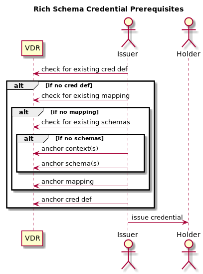

# 0428: Prerequisites to Issue Rich Credential
- Authors: [Brent Zundel](mailto:<brent.zundel@evernym.com>), [Ken Ebert](mailto:<ken@sovrin.org>)
- Status: [PROPOSED](/README.md#proposed)
- Since: 2020-02-20
- Status Note: Part of proposed Rich Schema capabilities for credentials 
- Supersedes: 
- Start Date: 2020-02-19 
- Tags: [feature](/tags.md#feature), [rich-schemas](/tags.md#rich-schemas)

## Summary

Describes the prerequisites an issuer must ensure are in place before issuing a
rich credential.

## Motivation

To inform issuers of the steps they should take in order to make sure they have
the necessary rich schema objects in place before they use them to issue
credentials.

## Tutorial

### Rich Schema Credential Workflow

1. The issuer checks the ledger to see if the credential definition he wants to
use is already present.
   1. If not, the issuer checks the ledger to see if the mapping he wants to use
   is already present.
      1. If not, the issuer checks the ledger to see if the schemas he wants to
      use are already present.
         1. If not, anchor the context used by each schema to the ledger.
         1. Anchor the schemas on the ledger. Schema objects may refer to one or
         more context objects.
      1. Anchor to the ledger the mapping object that associates each claim with
      one or more encoding objects and a corresponding attribute. (The issuer
      selects schema properties and associated encodings to be included as
      claims in the credential. Encoding objects refer to transformation
      algorithms, documentation, and code which implements the transformation.
      The claim is the data; the attribute is the transformed data represented
      as a 256 bit integer that is signed. The mapping object refers to the
      schema objects and encoding objects.)
   1. Anchor a credential definition that refers to a single mapping object. The
   credential definition contains public keys for each attribute. The credential
   definition refers to the issuer DID.
1. Using the credential definition, mapping, and schema(s) issue to the holder a
credential based on the credential definition and the supplied claim data. The
[Issue Credential Protocol 1.0](https://github.com/hyperledger/aries-rfcs/tree/main/features/0036-issue-credential)
will be the model for another RFC containing minor modifications to issue a
credential using the new rich schema objects. 

Subsequent credentials may be issued by repeating only the last step.

## Reference

- [RFC 0250: Rich Schema Objects](https://github.com/hyperledger/aries-rfcs/tree/main/concepts/0250-rich-schemas)
- [RFC 0420: Rich Schema Objects Common](https://github.com/hyperledger/aries-rfcs/tree/main/concepts/0420-rich-schemas-common)
- [RFC 0249: Aries Rich Schema Contexts](https://github.com/hyperledger/aries-rfcs/tree/main/features/0249-rich-schema-contexts)
- [RFC 0281: Aries Rich Schemas](https://github.com/hyperledger/aries-rfcs/tree/main/features/0281-rich-schemas)
- [RFC XXXX: Aries Rich Schema Mappings](https://github.com/hyperledger/aries-rfcs/tree/main/features/XXXX-rich-schema-mappings)
- [RFC XXXX: Aries Rich Schema Credential Definitions](https://github.com/hyperledger/aries-rfcs/tree/main/features/XXXX-rich-schema-cred-defs)
- [RFC 0036: Issue Credential Protocol 1.0](https://github.com/hyperledger/aries-rfcs/tree/main/features/0036-issue-credential)

## Unresolved questions

RFCs for Rich Schema Mappings and Rich Schema Credential Definitions are 
incomplete.
   
## Implementations

The following lists the implementations (if any) of this RFC. Please do a pull
request to add your implementation. If the implementation is open source,
include a link to the repo or to the implementation within the repo. Please be
consistent in the "Name" field so that a mechanical processing of the RFCs can
generate a list of all RFCs supported by an Aries implementation.

Name / Link | Implementation Notes
--- | ---
 | 
